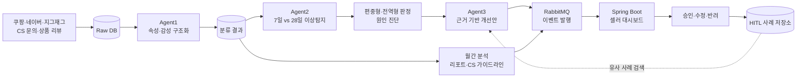
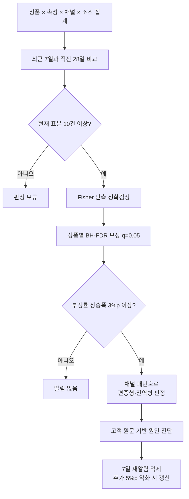
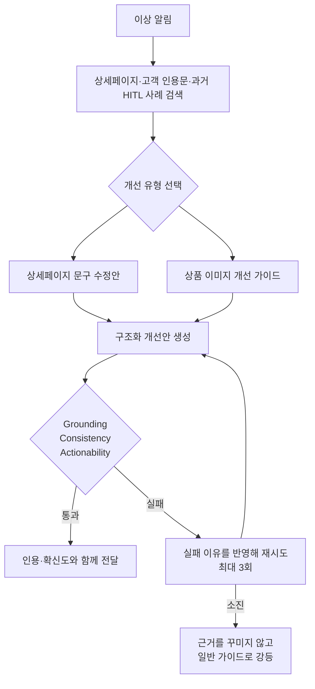

# 🛍️ SELLoN AI

> **멀티채널 VoC 기반 상품 이슈 탐지·진단 AI 플랫폼**

쿠팡·네이버·지그재그에 흩어진 CS 문의와 상품 리뷰를 상품 단위로 통합하고,
고객이 반복해서 말하는 문제를 탐지해 원인과 개선안까지 연결합니다.

SELLoN AI는 LLM 하나에 모든 판단을 맡기지 않습니다.

- **의미 해석**은 LLM이 담당합니다.
- **이상 판정**은 관측 데이터와 통계 검정으로 수행합니다.
- **환각 방어**는 스키마와 결정론적 검증 코드가 담당합니다.
- **최종 의사결정**은 셀러의 승인·수정·반려로 마무리합니다.

---

## 🎯 프로젝트 개요

오픈마켓을 여러 곳에서 운영하면 같은 상품의 CS와 리뷰가 채널별로 분산됩니다.
운영자는 엑셀과 개별 관리자 화면을 오가며 다음 질문에 직접 답해야 합니다.

1. 지금 어떤 상품 속성의 불만이 늘었는가?
2. 특정 채널만의 문제인가, 상품 전체의 문제인가?
3. 실제 고객 표현과 상세페이지를 근거로 무엇을 고쳐야 하는가?

SELLoN은 이 과정을 하나의 일일 분석 파이프라인으로 구성합니다.

| 입력 | 분석 | 출력 |
| --- | --- | --- |
| 3개 채널의 CS 문의·리뷰 | 속성·감성 분류, 시계열 통계 검정, 원인 진단 | 상품 이상 알림 |
| 상품 상세페이지 | 근거 검색, 개선안 생성, 인용 검증 | 문구 수정안·이미지 가이드 |
| 월간 VoC 집계 | 채널별 분포 차이와 추세 분석 | 월간 리포트 PDF |
| 셀러 피드백 | 승인·수정·반려 이력 축적 | 다음 개선안의 참고 사례 |

## 🔄 전체 흐름



운영 탐지 진입점은 [`app/batch/daily.py`](app/batch/daily.py)이며 일 1회 실행을
전제로 합니다. 탐지부터 개선안·CS 가이드라인 생성과 메시지 발행까지 조율합니다.
`POST /api/v1/detect`는 운영 배치가 아니라 특정 입력을 재현하는 디버깅 API입니다.

---

## 🧠 핵심 AI 기능

### Agent1. VoC 속성·감성 분류

비정형 문장을 통계 집계가 가능한 구조로 바꿉니다.

- **속성 기반 감성 분석(ABSA)**: 문장 전체가 아닌 색상·사이즈·소재 등 속성별 감성 분리
- **다중 라벨 분류**: 한 문장에 여러 상품 문제가 함께 있어도 모두 보존
- **소스별 정책**: CS는 6개 속성, 리뷰는 색상·사이즈·소재와 혼합 감성 처리
- **구조화 출력**: JSON 출력 후 Pydantic과 Enum으로 타입·허용 속성 검증
- **부분 실패 격리**: 한 항목의 파싱 실패가 같은 배치 전체를 중단하지 않음
- **운영 복구**: 분류 실패 기록, 재처리, 프롬프트 버전 변경 시 backfill 지원

고빈도 분류 경로는 처리량과 비용을 고려해 기본적으로 `gpt-4o-mini`를 사용합니다.

### Agent2. 통계적 이상탐지와 원인 진단

단순히 부정률이 높은 상품을 찾지 않습니다. 각 상품·채널이 자기 과거보다
유의미하게 악화됐는지를 단계별 관문으로 판단합니다.



| 관문 | 역할 |
| --- | --- |
| 최근 7일 vs 과거 28일 | 단기 변화에 반응하면서 기준선 표본 확보 |
| 최소 표본 10건 | 데이터가 부족한 채널의 과도한 비율 변동 방지 |
| Fisher 단측 정확검정 | 저빈도·소표본에서도 부정률 상승만 검정 |
| 상품별 BH-FDR | 한 상품에서 동시에 수행하는 다중 검정의 거짓 발견 제어 |
| 최소 상승폭 3%p | 통계적으로만 유의한 미세 변화를 실무 알림에서 제외 |
| 원문 coverage 검사 | 분류 누락으로 분모가 줄어 부정률이 부풀려지는 현상 차단 |

통계 검정을 통과한 편중형 후보만 LLM 원인 진단 대상으로 제한합니다. 원인 분류는
후속 개선안 품질에 직접 영향을 주기 때문에 실험⑥ 결과를 근거로 `gpt-4o`를 사용하고,
`CAUSE_LLM_MODEL`로 대량 처리용 기본 모델과 분리했습니다.

> `q=0.05`는 서비스 오탐률이 5%라는 뜻이 아닙니다. 모형 가정 아래에서 발견 집합의
> 거짓 발견 비율을 제어하기 위한 목표값입니다.

### Agent3. 근거 기반 개선안 생성

탐지 결과를 그럴듯한 문장으로 바꾸는 데서 끝내지 않고, 실제 근거가 확인된 제안만
셀러에게 전달합니다.



- **RAG**: ChromaDB에서 상세페이지와 유사한 승인·반려 사례 검색
- **Tool Calling**: 문구 수정과 이미지 가이드 중 근거에 맞는 개선 유형 선택
- **Grounding 검증**: 인용한 문구가 실제 상세페이지·고객 원문에 존재하는지 코드로 대조
- **자기검증 3관문**: 근거성, 원인 일관성, 실행 가능성을 모두 통과해야 승인
- **확신도 상한**: 탐지 근거가 중간이면 개선안이 임의로 높은 확신도를 표시하지 못함
- **HITL**: 셀러의 승인·수정·반려 결과를 다음 유사 사례의 참고 데이터로 축적

### 리포팅. 운영 판단을 위한 문서 생성

- 상품·채널별 월간 VoC와 감성 분포 집계
- Jensen-Shannon Divergence와 순열검정으로 채널 간 분포 차이 분석
- 다중비교 보정 후 셀러가 이해할 수 있는 표현으로 분석 문구 생성
- CS 답변 가이드라인 및 월간 합본 PDF 생성
- WeasyPrint 렌더링, S3 적재, 7일 Pre-signed URL 발급
- 생성 문장에 입력에 없는 수치·인용·통계 전문용어가 섞이지 않았는지 사후 검증

---

## 모델 운용 전략

| 용도 | 기본 모델 | 선정 근거 |
| --- | --- | --- |
| Agent1 분류, Agent3 개선안, 리포팅 | `gpt-4o-mini` | 대량·반복 처리 경로의 비용과 처리량 우선 |
| Agent2 원인 분류 | `gpt-4o` | 동일 평가에서 mini보다 높은 정확도와 낮은 회차 변동 확인 |
| RAG 임베딩 | `text-embedding-3-small` | 상세페이지·HITL 사례의 의미 기반 검색 |

모델명을 코드에 흩어 놓지 않고 `LLM_MODEL`과 `CAUSE_LLM_MODEL` 환경변수로 분리합니다.
모델 출력은 자유 형식으로 신뢰하지 않고 JSON, Tool Calling, Pydantic 검증을 거칩니다.

## 기술 스택

| 영역 | 기술 |
| --- | --- |
| API·배치 | Python 3.12, FastAPI, Uvicorn, asyncio |
| LLM | OpenAI API, JSON structured output, Tool Calling |
| 통계 | SciPy, statsmodels, NumPy |
| 데이터 계약 | Pydantic v2, Enum |
| 검색 | ChromaDB, OpenAI Embeddings |
| 메시징 | RabbitMQ Topic Exchange, Kafka KRaft |
| 저장·문서 | SQLite mock Raw DB, Amazon S3, WeasyPrint |
| 관측성 | 구조화 로그, LangSmith 선택 연동 |
| 품질 | pytest, pytest-asyncio, Ruff |

---

## 📊 검증 결과

아래 수치는 서로 다른 질문에 답하므로 하나의 “서비스 정확도”로 합치지 않습니다.

| 평가 대상 | 결과 | 해석 |
| --- | ---: | --- |
| Agent1 CS 부정 판별 | F1 **98.31%**, FPR **0.64%** | canonical 합성 mock 96,524건 기준 |
| Agent1 리뷰 속성 분류 | F1 **87.57%** | AI Hub Training 300건, 독립 3회 평균 |
| Agent2 E2E 탐지 | Recall **82.7%** | canonical mock 12,410건, 3회 평균·관측 범위 76~88% |
| Agent2 E2E 정상 케이스 | FPR **0/8** | 동일 3회에서 모두 0건, 정상 표본이 작아 일반화 금지 |
| Agent2 원인 분류 | `gpt-4o` **84.3%** | n=280 × 3회, mini 79.4%와 비교 |
| Agent3 Retrieval | **15/15** | canonical 소표본에서 상세페이지 조회 성공 |
| Agent3 Grounding | **6/6** | copy draft 라우팅 건의 실제 원문 근거 확인 |
| Agent3 Citation | **7/7**, evidence 이탈 0건 | image guide 라우팅 건의 고객 인용 검증 |
| Agent3 Tool Routing | **9~10/11** | 독립 실행 간 변동 존재 |

Agent2의 oracle 결과인 탐지 `25/25`, 정상 `0/8`, 판정 `33/33`은 정답 집계값을
주었을 때 구현이 명세대로 동작하는지를 확인한 회귀 검증입니다. 이를 실제 모델 성능으로
표현하지 않습니다.

평가셋의 성격, 실행 조건, 비용, 폐기된 결과와 한계는
[`eval/README.md`](eval/README.md)에 기록되어 있습니다.

---

## 🚀 빠른 시작

### 1. 환경 준비

검증 기준은 **Python 3.12**입니다.

```bash
python -m venv .venv

# Windows PowerShell
.\.venv\Scripts\Activate.ps1

# macOS / Linux
source .venv/bin/activate

pip install -r requirements.txt
```

전이 의존성까지 동일하게 맞추려면 `requirements.lock`을 사용합니다.

```bash
pip install -r requirements.lock
```

### 2. 환경변수 설정

```bash
cp .env.example .env
```

Windows PowerShell에서는 다음 명령을 사용할 수 있습니다.

```powershell
Copy-Item .env.example .env
```

최소 설정:

```dotenv
LLM_API_KEY=sk-...
LLM_MODEL=gpt-4o-mini
CAUSE_LLM_MODEL=gpt-4o
CHROMA_PERSIST_DIR=.chroma
RAW_DB_PATH=./data/raw.db
```

RabbitMQ·S3·LangSmith 설정은 필요한 기능을 실행할 때만 채웁니다. 전체 항목과 안전장치는
[`.env.example`](.env.example)에 설명되어 있습니다.

### 3. API 실행

```bash
uvicorn app.main:app --reload --port 8000
```

- Swagger UI: <http://localhost:8000/docs>
- Health check: <http://localhost:8000/health>

### 4. 테스트

```bash
python -m pytest -q
```

현재 브랜치 기준으로 pytest 테스트 **883개**가 수집됩니다. `tests/`는 외부 API를
호출하지 않으며 LLM 과금이 발생하지 않습니다.

---

## ⚙️ 로컬 파이프라인 실행

전체 파이프라인에는 git에 포함되지 않는 mock 입력 데이터가 필요합니다.
클론 직후에도 API health check와 테스트는 실행할 수 있지만, 아래 명령은
`data/input/`과 `data/raw.db`가 준비된 환경을 전제로 합니다.

### 상세페이지 벡터DB 시딩

```bash
python scripts/seed_vectordb.py
```

일반 시딩에는 `--reset`을 붙이지 마세요. 두 컬렉션과 축적된 HITL 사례까지 삭제됩니다.

### 분류 워커

```bash
# 비용을 제한한 시험 실행
python scripts/classification_worker.py --limit 50

# 신규 원문 계속 추적
python scripts/classification_worker.py --follow
```

분류는 원문 1건당 LLM 호출이 발생합니다. 처음 실행할 때는 반드시 `--limit`으로
예상 비용과 결과를 먼저 확인하세요.

### 일일 탐지 배치

```bash
# LLM을 호출하지 않고 예상 호출량과 배선 확인
python -m app.batch.daily --dry-run

# 후속 처리할 알림 수 제한
python -m app.batch.daily --max-alerts 3

# 특정 날짜 재현
python -m app.batch.daily --window-end 2026-08-28 --state-path .tmp/demo-state.json
```

`--state-path`를 분리하지 않은 재현 실행은 실제 발행 캐시를 오염시켜 이후 알림을
억제할 수 있습니다. 평가용 `--input-source golden`은 oracle 재현 전용이며 운영 성능이 아닙니다.

### 월간 리포트

```bash
python scripts/generate_monthly_reports.py --stage all --month 2026-07 --dry-run
```

### 로컬 RabbitMQ

로컬 브로커에서만 `.env`를 다음과 같이 설정합니다.

```dotenv
MQ_ENABLED=true
MQ_HOST=localhost
MQ_VHOST=/
MQ_COMPANY_ID=SLN-LOCAL
MQ_DECLARE_TOPOLOGY=true
```

```bash
docker compose up -d rabbitmq
python scripts/setup_local_mq.py
```

운영 RabbitMQ 토폴로지는 백엔드 인프라가 소유합니다. 운영에서는
`MQ_DECLARE_TOPOLOGY=false`를 유지하고 실제 회사 식별자를 사용해야 합니다.

---

## API

| Method | Endpoint | 용도 |
| --- | --- | --- |
| `GET` | `/health` | liveness·readiness |
| `POST` | `/api/v1/classify` | CS·리뷰 원문 속성·감성 분류 |
| `POST` | `/api/v1/detect` | 탐지 케이스 재현·디버깅 |
| `POST` | `/api/v1/recommendations/generate` | 알림 기반 개선안 생성 |
| `POST` | `/api/v1/recommendations/hitl` | 셀러 승인·반려 결과 적재 |
| `POST` | `/api/v1/reports` | 월간 상품 리포트 단건 생성 |
| `POST` | `/api/v1/replies` | CS 가이드라인·답변 초안 생성 |

요청·응답 모델은 [`app/core/schemas.py`](app/core/schemas.py), 상세 계약은
[`docs/schemas.md`](docs/schemas.md)를 참고하세요.

---

## 저장소 구조

```text
app/
├── main.py              FastAPI 앱과 라우터 등록
├── config.py            환경변수 로딩
├── batch/               일일 탐지·개선안·발행 오케스트레이션
├── core/                공용 스키마, LLM, DB, MQ, VectorDB 계약
├── classification/      Agent1 속성·감성 분류
├── detection/           Agent2 통계 탐지·원인 진단·재알림 억제
├── recommendation/      Agent3 RAG·Tool Calling·근거 검증·HITL
└── reporting/           월간 리포트·CS 가이드라인·PDF·S3

scripts/                 데이터 생성·분류 워커·시딩·운영 검산
tests/                   비용 없는 단위·통합·회귀 테스트
eval/                    성능 평가 스크립트와 재현 기록
docs/                    스키마·메시지·탐지·리포팅 설계 문서
data/                    로컬 입력·골든·실행 상태, 대부분 git 제외
```

`tests/`와 `eval/`은 목적이 다릅니다.

| | `tests/` | `eval/` |
| --- | --- | --- |
| 질문 | 코드 계약이 깨졌는가? | 모델·파이프라인 성능이 얼마인가? |
| 실행 시점 | 개발 중 수시로 | 실험 조건을 고정한 뒤 수동 실행 |
| 외부 호출 | 없음 | 실험에 따라 OpenAI 호출 발생 |
| 데이터 | fixtures | golden·외부 평가셋·canonical mock |

> `data/golden/`은 평가 코드만 읽습니다. 운영 `app/`이 골든 라벨을 참조하면
> 평가셋 누출이므로 금지합니다.

---

## 🛡️ 운영 안전장치

- 분류 결과 coverage가 불완전한 상품·채널·소스 슬롯은 통계 검정에서 제외
- LLM 응답의 필수 필드, ID 순서, taxonomy, confidence, evidence를 단계별 검증
- 후보 하나의 원인 진단 실패가 전체 탐지를 지우지 않도록 실패 격리
- 동일 상품·속성·채널 알림을 결정론적 ID와 재알림 정책으로 중복 억제
- 메시지 발행 실패를 성공으로 처리하지 않고 배치 종료 코드에 반영
- 회사별 VectorDB metadata 필터로 다른 고객사의 상세페이지·HITL 사례 격리
- 운영 코드와 평가 골든 데이터를 물리적으로 분리
- LLM 실험 결과에 모델명·프롬프트 버전·시드·데이터 지문 기록

## 현재 범위와 제한

- 이 저장소의 Raw DB 실행 어댑터는 현재 SQLite 파일 경로를 사용합니다.
- mock 입력·golden 데이터 대부분은 저장소에 포함되지 않습니다.
- CI는 GitHub Actions 워크플로 3종(`test.yml` · `image.yml` · `mock-producer.yml`)으로 돌립니다.
- 일일 배치 실행 코드는 구현되어 있지만 배포 스케줄러 정의는 이 저장소에 포함되지 않습니다.
- `POST /api/v1/reports`는 단건 미리보기용이고, 운영 월간 산출물은 배치가 합본 PDF로 생성합니다.
- 리포팅 완료 콜백은 현재 API 응답으로 반환합니다. Spring Boot callback push 전송은 별도 연동 범위입니다.
- 실제 유입 주기의 freshness·watermark 임계값은 아직 정하지 않았습니다 — 문서의 마지막
  날짜만으로는 **문의가 실제로 없었던 날과 수집 장애를 구분할 수 없어서**, 백엔드의 수집
  완료 신호가 확정된 뒤 구현합니다. coverage 제외 상태의 운영 노출도 같은 이유로 열려 있습니다.

---

## 📚 주요 문서

| 문서 | 내용 |
| --- | --- |
| [`개발환경-컨벤션.md`](개발환경-컨벤션.md) | 개발 환경, 브랜치, 코드·프롬프트 규칙 |
| [`eval/README.md`](eval/README.md) | 실험 7종의 실행법, 결과, 비용, 해석 한계 |
| [`docs/schemas.md`](docs/schemas.md) | Agent 간 공용 데이터 계약 |
| [`docs/이상탐지 로직.md`](docs/이상탐지%20로직.md) | Agent2 단계별 탐지 명세 |
| [`docs/이상탐지 시나리오.md`](docs/이상탐지%20시나리오.md) | 이상탐지 시나리오·분모 정의(§1) |
| [`docs/detection_schema.md`](docs/detection_schema.md) | 이상 알림 스키마 |
| [`docs/agent3_logic.md`](docs/agent3_logic.md) | 개선안 생성·검증·HITL 로직 |
| [`docs/recommenation_schema.md`](docs/recommenation_schema.md) | 개선안 출력 스키마 (파일명 `recommenation`은 오타지만 참조가 이 철자로 박혀 있어 그대로 둡니다) |
| [`docs/mq_events.md`](docs/mq_events.md) | RabbitMQ 이벤트 계약 |
| [`docs/reporting_schema.md`](docs/reporting_schema.md) | 월간 리포트·CS 가이드라인 계약 |
| [`docs/reporting_validation.md`](docs/reporting_validation.md) | 리포팅 산출물 검증 규칙·실험 설계 |
| [`docs/classified_item_version_columns.md`](docs/classified_item_version_columns.md) | 분류기 버전 컬럼 3종 명세·적용 절차 |
| [`docs/vectordb_tenancy.md`](docs/vectordb_tenancy.md) | 회사별 VectorDB 격리 정책 |

`docs/`는 위 표가 전부입니다 — 날짜가 붙은 시점 기록은 두지 않습니다(이력은 git이 갖습니다).

---

## 개발 원칙

1. LLM 호출은 `app/core/llm_client.py`를 통해 수행합니다.
2. 프롬프트는 모듈별 `prompts/`에 버전 파일로 보존합니다.
3. 모듈 간 계약은 `app/core/schemas.py`의 Pydantic 모델을 사용합니다.
4. `core/`와 공용 스키마 변경은 영향 범위를 먼저 공유합니다.
5. 임계값은 `app/core/constants.py`에서 근거와 함께 관리합니다.
6. 성능 개선과 평가·채점 기준 변경을 같은 효과로 보고하지 않습니다.
7. 평가 결과는 데이터, 모델, 프롬프트, 시드와 한계를 함께 기록합니다.

SELLoN의 목표는 알림을 많이 만드는 것이 아니라, **운영자가 확인할 가치가 있는 문제를
근거와 함께 전달하는 것**입니다.
